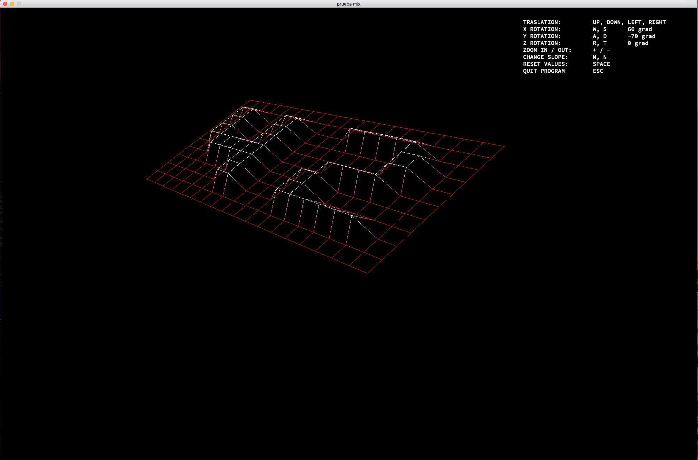
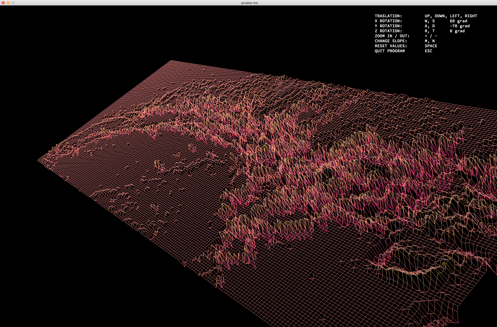

# FDF
This project attempts the basics of graphic programming, and in particular how to place points in space, how to join them with segments and most importantly how to observe the scene from a particular viewpoint using the graphic library: miniLibX. 
 
